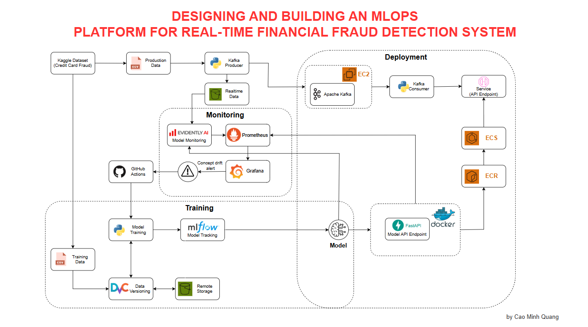

# Fraud Detection System — End-to-End Cloud Pipeline

MLOps pipeline for fraud detection using XGBoost, Kafka, MLflow, Prometheus & Grafana. All infrastructure managed by Terraform on AWS ECS Fargate.

```
Producer (local) ──Kafka──▶ Consumer (local) ──▶ API (ECS) ──▶ MLflow (ECS)
                                                            │
                                                     S3 (realtime/)
                                                            │
Drift Monitor (local) ◀─────────────────────────────────────┘
      │
      └── webhook ──▶ GitHub Actions ──▶ Retrain ──▶ MLflow (new model)
```

## Architecture



---

## Prerequisites

- AWS CLI configured (`aws configure`)
- Terraform ≥ 1.5
- Python ≥ 3.10
- Docker
- `pip install -r requirements.txt`
- `pip install -r requirements-drift.txt` (if running drift monitor)

---

## Step 1: Provision Infrastructure

Creates VPC, ECR repo, RDS (MLflow DB), ECS cluster, IAM roles, ALB, security groups.

```bash
cd terraform/environments/prod-infra
terraform init
terraform plan -out=tfplan
terraform apply tfplan
```

---

## Step 2: Build & Push API Image to ECR

Only the `api` image runs on ECS — everything else (producer, consumer, drift monitor) runs locally.

```bash
./build-and-push.sh
```

---

## Step 3: Deploy Application Services

Creates ECS services (MLflow, API, Kafka), task definitions, ALB rules, CloudWatch log groups.

```bash
cd terraform/environments/prod-app
terraform init
terraform plan -out=tfplan
terraform apply tfplan
```

After deployment, note the ALB DNS (printed in outputs or check AWS Console):

```
http://mlops-prod-1098509742.ap-southeast-1.elb.amazonaws.com:5000  → MLflow
http://mlops-prod-1098509742.ap-southeast-1.elb.amazonaws.com:8000  → API
```

---

## Step 4: Get Kafka Public IP

Kafka runs on ECS with a public IP (changes on restart).

```bash
scripts/get-kafka-ip.sh
```

Update `.env` with the IP and ALB DNS:

```bash
KAFKA_BOOTSTRAP_SERVERS=18.143.138.45:9092
ALB_DNS=mlops-prod-1098509742.ap-southeast-1.elb.amazonaws.com
```

The consumer, producer, and drift monitor all call `load_dotenv()` — they pick up `.env` automatically.

---

## Step 5: Run Producer (terminal 1)

Publishes credit card transaction data to Kafka.

```bash
source .env
python -m src.streaming.producer
# or: ./scripts/run-producer.sh
```

Expect ~57K records published.

---

## Step 6: Run Consumer (terminal 2)

Reads from Kafka, calls API for predictions, uploads results to S3.

```bash
source .env
python -m src.streaming.consumer
```

The consumer reads `KAFKA_BOOTSTRAP_SERVERS`, `ALB_DNS` (for API URL), `S3_BUCKET_NAME`, and `USE_S3` from `.env` automatically.

---

## Step 7: Run Drift Monitor (terminal 3)

Monitors data/concept drift via Evidently AI every 5 minutes. On drift, sends webhook to GitHub Actions which triggers retrain.

```bash
source .env
python -m src.monitoring.auto_drift_monitor \
  --model mlflow:Production \
  --interval 300 \
  --reference data/train/train_full.parquet
```

Configurable thresholds in `auto_drift_monitor.py:51-54`:
- `DRIFT_THRESHOLD = 0.05` — minimum data drift score to trigger alert
- `F1_THRESHOLD = 0.5` — minimum F1 for model comparison
- `MIN_NEW_DATA = 1000` — minimum records needed for retrain
- `RETRAIN_COOLDOWN_HOURS = 24` — minimum time between retrains

---

## API Usage

```bash
curl -X POST http://${ALB_DNS}:8000/predict \
  -H "Content-Type: application/json" \
  -d '{
    "features": {
      "V1": -1.34, "V2": 0.45, "V3": 1.23, "V4": -0.89,
      "V5": -0.34, "V6": 0.12, "V7": 0.45, "V8": -0.78,
      "V9": 0.23, "V10": -0.45, "V11": 1.23, "V12": -0.89,
      "V13": -0.34, "V14": 0.12, "V15": 0.45, "V16": -0.78,
      "V17": 0.23, "V18": -0.45, "V19": 1.23, "V20": -0.89,
      "V21": -0.34, "V22": 0.12, "V23": 0.45, "V24": -0.78,
      "V25": 0.23, "V26": -0.45, "V27": 1.23, "V28": -0.89,
      "Amount": 150.0, "Time": 50000
    }
  }'
```

---

## Environment Variables

| Variable | Default | Description |
|----------|---------|-------------|
| `AWS_DEFAULT_REGION` | `ap-southeast-1` | AWS region |
| `S3_BUCKET_NAME` | `retrain-data-fraud-detection` | S3 bucket for streaming/training data |
| `USE_S3` | `true` | Store data in S3 vs local |
| `KAFKA_BOOTSTRAP_SERVERS` | `localhost:9092` | Kafka broker address (public IP:9092 for cloud) |
| `MLFLOW_TRACKING_URI` | `http://localhost:5000` | MLflow server URI |
| `ALB_DNS` | — | ALB DNS name (for API URL fallback) |
| `DRIFT_WEBHOOK_URL` | — | GitHub API URL for retrain dispatch |
| `PAT_TOKEN` | — | GitHub personal access token |

---

## Troubleshooting

| Problem | Fix |
|---------|-----|
| Kafka connection refused | Kafka IP changes on restart — re-run `scripts/get-kafka-ip.sh` and update `.env` |
| ECS tasks stuck PENDING | Check service quotas, subnet IP availability, or task IAM role |
| Consumer can't reach API | Verify `ALB_DNS` in `.env` is correct; check API service is RUNNING in ECS |
| Drift monitor fails to load model | Ensure MLflow is reachable and model is registered under `FraudDetectionModel` |
| Terraform state locked | `rm .terraform.tfstate.lock.info` or from S3: `aws s3 rm s3://aws-terraform-remotebackend/.kafka/.../staterock` |

---

## Local Development (docker-compose)

For offline development without AWS:

```bash
docker-compose up -d
# Kafka :9092, MLflow :5000, Prometheus :9090, Grafana :3000
python -m src.train.train
python -m src.api.main
python -m src.streaming.producer
python -m src.streaming.consumer
```

---

## Project Structure

```
├── src/
│   ├── api/                    # FastAPI service (/predict, /health)
│   ├── streaming/              # Kafka producer & consumer
│   ├── pipeline/               # Label joiner, data prep, retrain
│   ├── monitoring/             # Drift detection (Evidently AI)
│   ├── train/                  # Training utilities
│   └── mlops/                  # S3 manager, data versioning
├── terraform/
│   ├── environments/
│   │   ├── prod-infra/         # VPC, ECR, RDS, cluster, IAM, ALB, SGs
│   │   └── prod-app/           # ECS services, task defs, ALB rules
│   └── modules/                # Reusable Terraform modules
├── scripts/                    # Utility scripts
├── .env                        # Environment variables
├── build-and-push.sh           # Build & push api image to ECR
├── Dockerfile                  # Multi-stage (api, producer, consumer, drift-monitor, webhook)
└── docker-compose.yml          # Local dev services
```

## Data Flow

1. **Streaming**: `creditcard.csv (staging)` → Producer → Kafka → Consumer → API (predict) → **S3 (realtime/)**
2. **Labeling**: **S3 (realtime/)** → Label Joiner → **S3 (labeled/)**
3. **Training**: **S3 (labeled/)** + train data → Prepare → Retrain (SMOTE) → **MLflow (new model)**
4. **Drift Detection**: S3 realtime data → Evidently AI → Prometheus metrics → Webhook → GitHub Actions → Retrain
